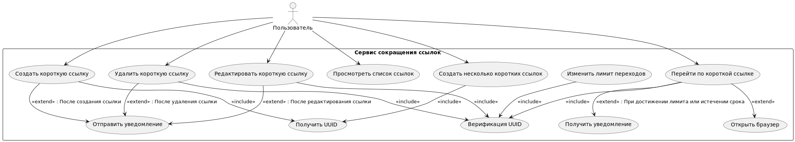
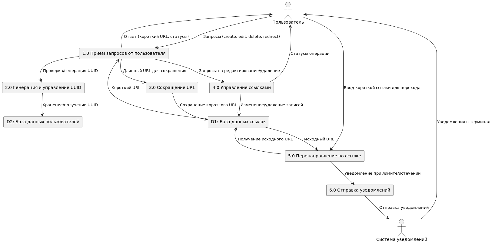

## Процесс проектирования: Основные этапы разработки системы управления короткими ссылками "Shortify"

### 1. Сбор и анализ требований

Группировка требований:
1. **Создание коротких ссылок**
  - *Система должна принимать длинный URL и преобразовывать его в короткую ссылку.*
  - *Пример: при передаче ссылки https://www.baeldung.com/java-9-http-client вы должны получить короткий вариант clck.ru/3DZHeG.*
  - *Сокращение ссылки.*
  - *Разработайте алгоритм, который будет преобразовывать длинные URL в короткие.*

2. **Уникальные ссылки для каждого пользователя**
  - *Если один и тот же ресурс сокращают разные пользователи, они должны получать уникальные сокращенные ссылки.*
  - *Уникальные ссылки для разных пользователей на один и тот же URL.*
  - *Уникальность ссылок.*

3. **Лимит переходов**
  - *Пользователь может задать максимальное количество переходов по ссылке.*
  - *После достижения этого лимита ссылка должна стать недоступной.*
  - *Реализуйте систему, которая будет отслеживать количество переходов по каждой ссылке.*
  - *Ссылка должна блокироваться после достижения заданного пользователем лимита переходов.*

4. **Ограничение времени жизни ссылки**
  - *Время жизни ссылки должно задаваться системой и ограничиваться определенным сроком (например, сутки).*
  - *После истечения этого срока ссылка должна автоматически удаляться.*
  - *Время жизни ссылки должно задаваться программно, а не пользователем.*
  - *Автоматическое удаление по истечении времени.*
  - *Система должна автоматически удалять короткие ссылки после заданного срока действия (например, сутки).*
  - *Автоматическое удаление по истечении времени.*

5. **Уведомление пользователя**
  - *Пользователь должен получать уведомление, если лимит переходов исчерпан или время жизни ссылки истекло.*
  - *Уведомления об истечении лимита или времени.*
  - *Пользователь получает уведомление, когда ссылка становится недоступной из-за исчерпания лимита переходов или истечения времени жизни.*

6. **Идентификация пользователя по UUID**
  - *Каждый пользователь идентифицируется без авторизации с помощью UUID, который генерируется при первом запросе на создание короткой ссылки.*
  - *Этот UUID используется для отслеживания всех действий пользователя с его ссылками.*
  - *UUID пользователя генерируется при первом запросе на создание короткой ссылки и сохраняется для последующей работы с его ссылками.*
  - *Все действия по редактированию или удалению ссылок доступны только создателю этой ссылки, идентифицируемому по UUID.*

7. **Переход по короткой ссылке**
  - *При вводе короткой ссылки в консоль пользователь должен автоматически перенаправляться на исходный ресурс в браузере.*
  - *Перенаправление на исходный URL.*
  - *Автоматическое перенаправление на исходный ресурс при вводе короткой ссылки.*

8. **Управление ссылками через консоль**
  - *Пользователь может управлять своими короткими ссылками через консоль, включая создание новых, изменение лимитов переходов и удаление ссылок.*
  - *Управляться через консоль, включая переходы по сокращенным ссылкам.*

9. **Работа нескольких пользователей**
  - *Сервис поддерживает работу нескольких пользователей, каждый из которых может создавать уникальные короткие ссылки.*
  - *Поддержка нескольких пользователей.*
  - *Сервис должен поддерживать работу нескольких пользователей одновременно, обеспечивая уникальность ссылок для каждого из них.*

10. **Администрирование параметров ссылки**
  - *Только создатель ссылки может редактировать её параметры или удалять её.*
  - *Редактирование параметров.*
  - *Администрирование параметров ссылки.*

11. **Повторное создание ссылок**
  - *При повторном запросе сокращения той же ссылки, пользователю должна быть сгенерирована новая ссылка.*
  - *Повторное создание ссылок.*
  - *Генерация новой ссылки при повторном запросе сокращения того же URL.*

12. **Создание нескольких ссылок**
  - *Один пользователь может создавать несколько коротких ссылок на разные ресурсы.*
  - *Множественные короткие ссылки.*
  - *Создание нескольких ссылок.*

13. **Идентификация по UUID при повторных запросах**
  - *Система идентифицирует пользователя по UUID и генерирует уникальную ссылку при каждом запросе.*
  - *Идентификация по UUID при повторных запросах.*

14. **Интуитивно понятный интерфейс**
  - *Сервис должен быть интуитивно понятным для пользователей, обеспечивая простой и понятный процесс создания и управления ссылками.*

15. **Конфигурация системы**
  - *Внесение основных параметров работы алгоритма в конфигурационный файл.*
  - *Основные параметры работы алгоритма (например, время жизни ссылок) должны быть вынесены в отдельный конфигурационный файл, позволяющий изменять параметры без изменения кода.*
  - *Внесение основных параметров работы алгоритма в конфигурационный файл.*

### 2. Анализ и систематизация требований

#### 1. Таблица требований

| **ID Требования** | **Тип** | **Описание Требования**                                                                                                                                                     |
|--------------------|---------|------------------------------------------------------------------------------------------------------------------------------------------------------------------------------|
| FR-1               | ФР      | **Создание коротких ссылок**: Система должна принимать длинный URL и преобразовывать его в короткую ссылку.                                                                    |
| FR-2               | ФР      | **Уникальные ссылки для каждого пользователя**: Если один и тот же длинный URL сокращают разные пользователи, система должна генерировать уникальные короткие ссылки для каждого из них. |
| FR-3               | ФР      | **Лимит переходов**: Пользователь может задать максимальное количество переходов по каждой короткой ссылке. После достижения лимита ссылка должна стать недоступной.             |
| FR-4               | ФР      | **Ограничение времени жизни ссылки**: Система должна автоматически удалять короткие ссылки после истечения заданного срока действия (например, сутки).                            |
| FR-5               | ФР      | **Уведомление пользователя**: Пользователь должен получать уведомление текстовыми сообщениями в терминал, если лимит переходов исчерпан или время жизни ссылки истекло.          |
| FR-6               | ФР      | **Идентификация пользователя по UUID**: Каждый пользователь идентифицируется с помощью UUID, который генерируется при первом запросе на создание короткой ссылки.                 |
| FR-7               | ФР      | **Переход по короткой ссылке**: При вводе короткой ссылки в консоль пользователь автоматически перенаправляется на исходный URL в браузере.                                       |
| FR-8               | ФР      | **Управление ссылками через консоль**: Пользователь может управлять своими короткими ссылками через консоль, включая создание новых, изменение лимитов переходов и удаление ссылок. |
| FR-9               | ФР      | **Работа нескольких пользователей**: Сервис поддерживает работу нескольких пользователей одновременно, обеспечивая уникальность ссылок для каждого из них.                        |
| FR-10              | ФР      | **Администрирование параметров ссылки**: Только создатель ссылки может редактировать её параметры или удалять её.                                                                |
| FR-11              | ФР      | **Повторное создание ссылок**: При повторном сокращении того же длинного URL пользователю должна генерироваться новая уникальная короткая ссылка.                                     |
| FR-12              | ФР      | **Создание нескольких ссылок**: Один пользователь может создавать несколько коротких ссылок на разные ресурсы.                                                                    |
| FR-13              | ФР      | **Идентификация по UUID при повторных запросах**: Система идентифицирует пользователя по UUID и генерирует уникальную ссылку при каждом запросе на сокращение URL.               |
| NFR-1              | НФР     | **Интуитивно понятный интерфейс**: Сервис должен быть интуитивно понятным для пользователей, обеспечивая простой и понятный процесс создания и управления ссылками.                 |
| NFR-2              | НФР     | **Конфигурация системы**: Основные параметры работы алгоритма (например, время жизни ссылок) должны быть вынесены в отдельный конфигурационный файл, позволяющий изменять параметры без изменения кода. |

#### Диаграммы
Варианты использования

Потоки данных

#### 2. Матрица трассируемости требований

| **ID Требования** | **Описание Требования**                                              | **Связанные Варианты Использования**                                | **Связанные Процессы DFD**                          | **Тестовые Случаи**                                                      |
|--------------------|-----------------------------------------------------------------------|---------------------------------------------------------------------|-----------------------------------------------------|--------------------------------------------------------------------------|
| FR-1               | **Создание коротких ссылок**                                          | Создать короткую ссылку                                              | 3.0 Сокращение URL                                   | TC-1: Проверка корректного создания короткой ссылки                      |
| FR-2               | **Уникальные ссылки для каждого пользователя**                        | Создать короткую ссылку, Создать несколько ссылок                   | 2.0 Генерация и управление UUID, 3.0 Сокращение URL   | TC-2: Проверка уникальности ссылок для разных пользователей               |
| FR-3               | **Лимит переходов**                                                   | Изменить лимит переходов, Редактировать ссылку                      | 4.0 Управление ссылками                              | TC-3: Проверка установки и достижения лимита переходов                   |
| FR-4               | **Ограничение времени жизни ссылки**                                 | Создать короткую ссылку                                              | 3.0 Сокращение URL, 6.0 Отправка уведомлений          | TC-4: Проверка автоматического удаления ссылки по времени                |
| FR-5               | **Уведомление пользователя**                                         | Создать короткую ссылку, Редактировать ссылку, Удалить ссылку, Перейти по ссылке | 6.0 Отправка уведомлений                       | TC-5: Проверка отправки уведомлений текстовыми сообщениями в терминал     |
| FR-6               | **Идентификация пользователя по UUID**                               | Получить UUID, Создать короткую ссылку, Редактировать ссылку, Удалить ссылку, Перейти по ссылке | 2.0 Генерация и управление UUID          | TC-6: Проверка генерации и верификации UUID                               |
| FR-7               | **Переход по короткой ссылке**                                        | Перейти по короткой ссылке                                           | 5.0 Перенаправление по ссылке                        | TC-7: Проверка перенаправления по короткой ссылке                         |
| FR-8               | **Управление ссылками через консоль**                                 | Редактировать ссылку, Удалить ссылку, Просмотреть список ссылок      | 1.0 Прием запросов от пользователя, 4.0 Управление ссылками | TC-8: Проверка управления ссылками через консоль                         |
| FR-9               | **Работа нескольких пользователей**                                  | Создать короткую ссылку, Создать несколько ссылок                   | 2.0 Генерация и управление UUID, 3.0 Сокращение URL   | TC-9: Проверка работы нескольких пользователей                           |
| FR-10              | **Администрирование параметров ссылки**                              | Редактировать ссылку, Изменить лимит переходов                       | 4.0 Управление ссылками                              | TC-10: Проверка редактирования параметров ссылки                          |
| FR-11              | **Повторное создание ссылок**                                        | Создать короткую ссылку, Создать несколько ссылок                   | 3.0 Сокращение URL                                   | TC-11: Проверка генерации новой ссылки при повторном запросе              |
| FR-12              | **Создание нескольких ссылок**                                       | Создать несколько коротких ссылок                                     | 3.0 Сокращение URL, 2.0 Генерация и управление UUID   | TC-12: Проверка создания нескольких ссылок одним пользователем           |
| FR-13              | **Идентификация по UUID при повторных запросах**                     | Получить UUID, Создать короткую ссылку                               | 2.0 Генерация и управление UUID                       | TC-13: Проверка идентификации пользователя по UUID при повторных запросах |
| NFR-1              | **Интуитивно понятный интерфейс**                                    | Все варианты использования                                          | Все процессы DFD                                     | TC-NFR-1: Проверка удобства использования интерфейса                      |
| NFR-2              | **Конфигурация системы**                                             | Все варианты использования                                          | Все процессы DFD                                     | TC-NFR-2: Проверка загрузки и применения конфигурационного файла          |

#### Примечания:

1. **ID Требования**:
  - **FR-1** до **FR-13**: Функциональные требования.
  - **NFR-1** и **NFR-2**: Нефункциональные требования.

2. **Связанные Варианты Использования**:
  - Варианты использования (Use Cases) из диаграммы вариантов использования, которые реализуют данное требование.

3. **Связанные Процессы DFD**:
  - Процессы из диаграммы потоков данных (DFD), участвующие в реализации требования.

4. **Тестовые Случаи**:
  - **TC-1** до **TC-13**: Тестовые случаи для функциональных требований.
  - **TC-NFR-1** и **TC-NFR-2**: Тестовые случаи для нефункциональных требований.

#### Дополнительные пояснения:

- **Функциональные требования (FR)** описывают конкретные функции и задачи, которые должна выполнять система.
- **Нефункциональные требования (NFR)** определяют качества и характеристики системы, такие как удобство использования и возможность конфигурации.
- **Тестовые Случаи** предназначены для проверки корректного выполнения каждого требования.
- **Матрица трассируемости** помогает убедиться, что все требования были учтены и реализованы в процессе разработки, а также что существуют соответствующие тестовые случаи для проверки их выполнения.

---

---

---

### 3. Проектирование архитектуры

#### **Общая архитектура системы**

1. **Пользовательский интерфейс (UI)**
   - **Консольный интерфейс**
2. **Логика приложения**
   - **Менеджер команд (Command Manager)**
   - **Модуль идентификации пользователя (User Identification Module)**
   - **Сервис сокращения ссылок (URL Shortening Service)**
   - **Менеджер ссылок (Link Manager)**
   - **Модуль перенаправления (Redirect Module)**
   - **Модуль уведомлений (Notification Module)**
   - **Конфигурационный модуль (Configuration Module)**
   - **Модуль безопасности (Security Module)**
3. **Хранение данных**
   - **База данных пользователей**
   - **База данных ссылок**

#### **Детальное описание компонентов и модулей**

##### **1. Пользовательский интерфейс (UI)**

- **Функции:**
  - Отображение меню и подсказок.
  - Приём команд и данных от пользователя.
  - Вывод результатов операций и уведомлений.
- **Взаимодействия:**
  - Передаёт введённые данные в Менеджер команд.
  - Получает и отображает уведомления от Модуля уведомлений.

##### **2. Менеджер команд (Command Manager)**

- **Функции:**
  - Обработка и парсинг введённых пользователем команд.
  - Валидация синтаксиса и семантики команд.
  - Маршрутизация команд к соответствующим модулям.
- **Взаимодействия:**
  - Получает данные от Пользовательского интерфейса.
  - Взаимодействует с другими модулями для выполнения команд.

##### **3. Модуль идентификации пользователя (User Identification Module)**

- **Функции:**
  - Генерация UUID при первом обращении пользователя.
  - Хранение и управление UUID пользователей.
  - Аутентификация пользователя при последующих запросах.
- **Взаимодействия:**
  - Обменивается данными с Менеджером команд.
  - Доступ к Базе данных пользователей для хранения UUID.

##### **4. Сервис сокращения ссылок (URL Shortening Service)**

- **Функции:**
  - Генерация уникальных коротких ссылок.
  - Обеспечение уникальности ссылок для каждого пользователя.
- **Взаимодействия:**
  - Получает запросы на сокращение ссылок от Менеджера команд.
  - Сохраняет данные в Базе данных ссылок.
  - Взаимодействует с Модулем идентификации пользователя для привязки ссылок к UUID.

##### **5. Менеджер ссылок (Link Manager)**

- **Функции:**
  - Редактирование параметров ссылок (лимит переходов, время жизни).
  - Удаление ссылок.
  - Просмотр списка ссылок пользователя.
- **Взаимодействия:**
  - Получает команды от Менеджера команд.
  - Взаимодействует с Модулем идентификации для проверки прав доступа.
  - Работает с Базой данных ссылок для изменения данных.

##### **6. Модуль перенаправления (Redirect Module)**

- **Функции:**
  - Обработка переходов по коротким ссылкам.
  - Проверка лимита переходов и времени жизни ссылки.
  - Перенаправление пользователя на исходный URL.
- **Взаимодействия:**
  - Получает запросы от Менеджера команд.
  - Читает и обновляет данные в Базе данных ссылок.
  - Взаимодействует с Модулем уведомлений при достижении лимитов.

##### **7. Модуль уведомлений (Notification Module)**

- **Функции:**
  - Отправка уведомлений пользователю через терминал.
  - Информирование о достижении лимита переходов или истечении времени жизни ссылки.
- **Взаимодействия:**
  - Получает события от других модулей.
  - Передаёт сообщения в Пользовательский интерфейс.

##### **8. Конфигурационный модуль (Configuration Module)**

- **Функции:**
  - Загрузка настроек системы из конфигурационного файла.
  - Предоставление настроек другим модулям по запросу.
- **Взаимодействия:**
  - Читает конфигурационный файл при запуске системы.
  - Отвечает на запросы модулей о текущих настройках.

##### **9. Модуль безопасности (Security Module)**

- **Функции:**
  - Обеспечение безопасности данных (например, шифрование UUID).
  - Контроль доступа к функциям системы.
- **Взаимодействия:**
  - Проверяет права доступа при операциях над ссылками.
  - Взаимодействует с Модулем идентификации и Менеджером ссылок.

##### **10. Базы данных**

- **База данных пользователей:**
  - **Функции:**
    - Хранение UUID и связанных с пользователем данных.
  - **Взаимодействия:**
    - Используется Модулем идентификации пользователя.

- **База данных ссылок:**
  - **Функции:**
    - Хранение информации о ссылках, включая длинные и короткие URL, лимиты переходов, время жизни, счётчики переходов.
  - **Взаимодействия:**
    - Используется Сервисом сокращения ссылок, Менеджером ссылок, Модулем перенаправления.

---

#### **Взаимодействия между компонентами**

1. **Пользовательский интерфейс ↔ Менеджер команд**
  - Пользователь вводит команды, которые передаются для обработки.
  - Получает результаты операций и уведомления для отображения.

2. **Менеджер команд ↔ Модули логики приложения**
  - Определяет тип команды и направляет её в соответствующий модуль.
  - Сбор и передача результатов операций обратно в UI.

3. **Модули логики приложения ↔ Базы данных**
  - Доступ к данным пользователей и ссылок для выполнения операций.
  - Обеспечение целостности и актуальности данных.

4. **Модуль уведомлений ↔ Пользовательский интерфейс**
  - Отправка уведомлений для отображения в терминале.

5. **Конфигурационный модуль ↔ Другие модули**
  - Предоставление настроек (например, стандартное время жизни ссылок).

6. **Модуль безопасности ↔ Другие модули**
  - Проверка прав доступа и обеспечение безопасности операций.

---

#### **Поток выполнения основных операций**

##### **1. Создание короткой ссылки**

- Пользователь вводит команду создания ссылки с длинным URL.
- **Менеджер команд** получает команду и передаёт её в **Модуль идентификации пользователя** для проверки или генерации UUID.
- Затем команда передаётся в **Сервис сокращения ссылок**, который:
  - Генерирует уникальную короткую ссылку.
  - Сохраняет информацию о ссылке в **Базе данных ссылок**, связывая её с UUID пользователя.
- Результат возвращается через **Менеджер команд** в **Пользовательский интерфейс** для отображения пользователю.

##### **2. Переход по короткой ссылке**

- Пользователь вводит короткую ссылку для перехода.
- **Менеджер команд** передаёт запрос в **Модуль перенаправления**, который:
  - Проверяет существование ссылки и её параметры (лимит переходов, время жизни).
  - Увеличивает счётчик переходов.
  - При необходимости взаимодействует с **Модулем уведомлений** для информирования пользователя.
  - Перенаправляет пользователя на исходный URL.
- Если ссылка недоступна, пользователь получает соответствующее уведомление.

##### **3. Редактирование или удаление ссылки**

- Пользователь вводит команду редактирования или удаления ссылки.
- **Менеджер команд** обращается к **Модулю идентификации пользователя** для проверки UUID.
- Команда передаётся в **Менеджер ссылок**, который:
  - Проверяет права доступа через **Модуль безопасности**.
  - Выполняет редактирование или удаление в **Базе данных ссылок**.
- Результат операции передаётся обратно пользователю через интерфейс.

---

#### **Диаграмма компонентов (текстовое описание)**

1. **UserInterface** (UI)
  - Взаимодействует с **CommandManager**.
  - Отображает данные пользователю.

2. **CommandManager**
  - Принимает команды от **UI**.
  - Взаимодействует с **UserIdentificationModule**, **URLShorteningService**, **LinkManager**, **RedirectModule**.

3. **UserIdentificationModule**
  - Взаимодействует с **CommandManager**.
  - Использует **UserDatabase** для хранения UUID.

4. **URLShorteningService**
  - Взаимодействует с **CommandManager**.
  - Использует **LinkDatabase** для сохранения ссылок.

5. **LinkManager**
  - Взаимодействует с **CommandManager**.
  - Использует **LinkDatabase**.
  - Проверяет права доступа через **SecurityModule**.

6. **RedirectModule**
  - Взаимодействует с **CommandManager**.
  - Использует **LinkDatabase**.
  - Обращается к **NotificationModule** при достижении лимитов.

7. **NotificationModule**
  - Взаимодействует с **RedirectModule**, **LinkManager**.
  - Отправляет уведомления через **UI**.

8. **ConfigurationModule**
  - Предоставляет настройки другим модулям.

9. **SecurityModule**
  - Обеспечивает безопасность операций.
  - Взаимодействует с **LinkManager**, **UserIdentificationModule**.

10. **UserDatabase** и **LinkDatabase**
  - Хранят данные пользователей и ссылок соответственно.
  - Используются соответствующими модулями.

---

- **Чистая архитектура и принципы SOLID**: разделение проекта на слои: Presentation (контроллер), Application (сервисы),
  Domain (бизнес-объекты и бизнес-правила), Infrastructure (репозитории и конфигурация).
- **Определение основных компонентов**:
    - **CommandLineController**: контроллер для взаимодействия через командную строку.
    - **ShortLinkService**: сервис для работы с короткими ссылками.
    - **UserService**: сервис для создания и управления UUID пользователей.
    - **ConfigLoader**: класс для загрузки конфигурации из файла.

---

---

---

### 4. Проектирование базы данных и данных

- **Определение сущностей**:
    - **User (Пользователь)**: включает `userId` (UUID).
    - **ShortLink (Короткая ссылка)**: включает `shortUrl`, `originalUrl`, `expirationDate`, `clickLimit`,
      `currentClickCount`.
- **ER-диаграмма**: представление связей между пользователями и ссылками (связь один ко многим).
- **Хранение данных**: на этапе прототипирования используется In-memory репозиторий, для полноценного приложения
  возможна миграция на реляционную базу данных.

### 5. Проектирование конфигурации

- **Конфигурационный файл (********`config.properties`********\*\*\*\*)**: хранение параметров, таких как
  `defaultExpirationDays`, `defaultClickLimit`, `cleanupIntervalMinutes`.
- **Загрузка конфигурации**: реализовано через `ConfigLoader`, который использует `ClassLoader` для загрузки файла из
  ресурсов.

### 6. Реализация начальной структуры кода

- **Создание основных классов**:
    - **CommandLineController**: реализован для обработки команд пользователя (`create`, `delete`, `edit`, `show`,
      `exit`).
    - **ShortLinkService** и **UserService**: включают основную логику работы с пользователями и ссылками.
    - **InMemoryShortLinkRepository**: используется для хранения ссылок в памяти.
- **Переименование основного класса**: основной класс проекта назван `Shortify` для соответствия имени приложения.

### 7. Тестирование и проверка функциональности

- **Юнит-тесты**: создание юнит-тестов для проверки основных методов классов `ShortLinkService`, `UserService` и
  `CommandLineController`.
- **Тестирование сценариев использования**: проверка создания и редактирования ссылок, работы с лимитами и сроками жизни
  ссылок.
- **Проверка уведомлений**: тестирование уведомлений пользователю при достижении лимита переходов или истечении времени
  жизни ссылки.

### 8. Документация и поддержка

- **Создание пользовательской документации**: подготовка документации для пользователей (как пользоваться командной
  строкой для создания, редактирования, удаления ссылок).
- **Техническая документация**: описание архитектуры, бизнес-логики и процессов разработки, включая диаграммы классов и
  последовательностей.

### 9. Внедрение и поддержка

- **Запуск системы**: развертывание и запуск приложения в тестовой среде.
- **Обратная связь**: сбор отзывов пользователей для улучшения функционала и выявления потенциальных проблем.
- **Поддержка и обновления**: планирование будущих улучшений, таких как добавление нового интерфейса (например,
  веб-интерфейс) или миграция данных в полноценное хранилище.

